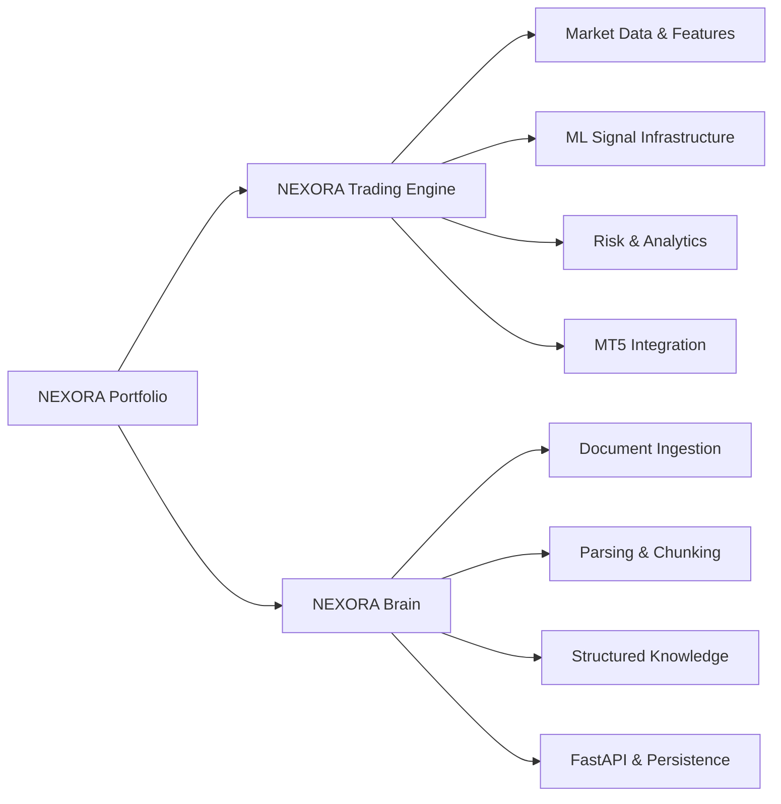

# NEXORA

### AI, Machine Learning, Data & Backend Engineering Portfolio

NEXORA is an independent engineering ecosystem exploring how machine learning, data pipelines, backend services, analytics, and structured knowledge systems can be combined into practical applications.

This repository is the **public portfolio entry point** for the NEXORA ecosystem. It intentionally contains no private trading models, credentials, datasets, strategy parameters, or proprietary implementation details.

> **Portfolio note:** NEXORA is an independently developed project under active development. Public repositories are curated engineering showcases rather than the complete private system.

---

## Public Projects

### 1. [NEXORA Trading Engine](https://github.com/AshwinThakoor/nexora-trading-engine)

An AI-assisted algorithmic trading engineering project focused on market-data analysis, ML-driven signal infrastructure, risk controls, analytics, and integration with MetaTrader 5.

**Engineering areas demonstrated**

- Python application development
- FastAPI service architecture
- Machine-learning signal workflows
- LightGBM-based modeling
- MetaTrader 5 integration
- Market/candle feature engineering
- Risk-management architecture
- Trading analytics and performance analysis
- Docker / WSL development workflow
- API and system-status interfaces

The public repository is deliberately sanitized. Private model artifacts, datasets, exact strategy rules, thresholds, execution logic, and commercially sensitive research are not published.

**Repository:** [github.com/AshwinThakoor/nexora-trading-engine](https://github.com/AshwinThakoor/nexora-trading-engine)

---

### 2. [NEXORA Brain](https://github.com/AshwinThakoor/nexora-brain)

A Python knowledge-management and document-intelligence engine designed around deterministic ingestion, parsing, chunking, structured knowledge representation, persistent storage, and API-driven access.

**Engineering areas demonstrated**

- Python and FastAPI
- SQLAlchemy data modeling
- Alembic database migrations
- Document ingestion pipelines
- PDF, DOCX, TXT, Markdown and HTML parsing
- Deterministic document chunking
- Knowledge structures for concepts, claims, evidence and relationships
- Service and repository architecture
- Provider-neutral authorization policies
- Automated testing with pytest
- GitHub Actions CI
- Configuration and secret-management practices

The project establishes infrastructure that can support future retrieval and LLM-based capabilities. It does **not** claim a finished production RAG platform, autonomous AI agent, or commercial SaaS product.

**Repository:** [github.com/AshwinThakoor/nexora-brain](https://github.com/AshwinThakoor/nexora-brain)

---

## Ecosystem Overview

NEXORA is intentionally separated into focused repositories so each engineering domain can be reviewed independently while sensitive research remains private.

---

## Technology Snapshot

| Area | Technologies / Concepts |
|---|---|
| Programming | Python |
| Backend | FastAPI, REST APIs |
| Machine Learning | LightGBM, feature engineering, predictive signal workflows |
| Data | Pandas, structured processing, analytics pipelines |
| Persistence | SQLAlchemy, Alembic, SQLite-compatible development |
| Document Intelligence | Parsing, ingestion, deterministic chunking, structured knowledge |
| Trading Integration | MetaTrader 5, market-data workflows |
| Engineering | Git, GitHub, Docker, WSL, pytest, GitHub Actions |

---

## What This Portfolio Demonstrates

Rather than presenting isolated notebooks, NEXORA focuses on **end-to-end engineering**: defining system boundaries, processing data, exposing APIs, integrating components, designing persistence, building tests, documenting architecture, and iterating on ML-enabled systems.

The projects demonstrate experience across three connected areas:

**AI & Machine Learning** — feature engineering, predictive modeling infrastructure, model-driven workflows, and foundations for retrieval/LLM systems.

**Data Engineering & Analytics** — ingestion, transformation, structured storage, analytics, document processing, and reproducible data flows.

**Backend Engineering** — FastAPI services, database models, migrations, modular service architecture, API integration, configuration, testing, and system documentation.

---

## Repository Boundaries & IP

The public NEXORA repositories are designed for technical evaluation and portfolio review. The complete private NEXORA environment contains additional research and implementation that is intentionally not published.

Public code must not be interpreted as disclosure of the complete trading strategy or full private system. Credentials, private datasets, trained model artifacts, exact trading parameters, proprietary decision logic, and sensitive configuration are excluded from the recruiter-facing repositories.

---

## For Recruiters & Engineers

For the quickest technical review:

1. Start with **NEXORA Brain** to review backend architecture, APIs, database design, ingestion, document processing, migrations, and testing.
2. Continue with **NEXORA Trading Engine** to review the ML/trading system architecture, analytics, risk-management design, and MT5 integration.
3. Each repository contains its own architecture and project documentation for deeper review.

Both projects are independent portfolio work and remain under active development.

---

## Author

**Ashwin Thakoor**  
AI, Data & Backend Development  
Mauritius · Open to international relocation and remote opportunities

[LinkedIn](https://www.linkedin.com/in/ashwin-thakoor-7aa2a3373) · [GitHub](https://github.com/AshwinThakoor)

---

## License & Usage

The NEXORA portfolio and associated public NEXORA repositories are provided for portfolio evaluation and technical review. Individual repositories contain their applicable licensing and usage terms.

**© 2026 NEXORA / Ashwin Thakoor. All rights reserved where stated by the applicable repository license.**
