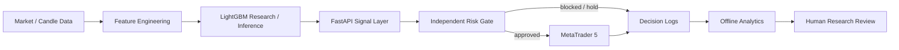
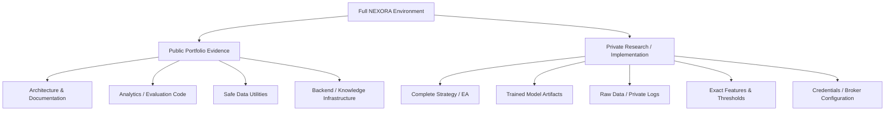

# NEXORA AI

### Machine Learning • Data • FastAPI • MetaTrader 5 • Risk Engineering

**Recruiter-facing entry point for my independent NEXORA engineering project.**

NEXORA explores an end-to-end ML-assisted trading system: market/candle data is processed into model features, a LightGBM research workflow produces directional signals and confidence, a Python/FastAPI service forms the integration boundary, independent risk controls can permit or block candidate actions, MetaTrader 5 provides the execution environment, and structured logs feed offline analytics.

> **Project status:** active research and development. NEXORA is not presented as a guaranteed-profit, audited production trading system. Private models, datasets, exact strategy rules, credentials and tuned execution parameters are intentionally excluded from the public portfolio.

## Resume-to-GitHub evidence

The NEXORA entry on my resume is intentionally mirrored by inspectable public evidence.

| Resume claim | Public evidence |
|---|---|
| Python/FastAPI signal-system architecture | `nexora-trading-engine` architecture and backend/API documentation |
| MetaTrader 5 integration | Trading-engine system/sequence diagrams and integration documentation |
| XAUUSD M5 research scope | Trading-engine README and project context |
| LightGBM directional modeling | Trading-engine ML research/evaluation documentation and analytics workflows |
| Engineered market/candle features | Feature-pipeline architecture and evaluation tooling; exact formulas remain private |
| Confidence-based analysis | Public confidence/segment/evaluation analytics |
| Risk controls | Independent risk-gate architecture covering exposure, session/context and no-trade behavior |
| Docker / WSL development | Public development/environment documentation |
| Data and backend engineering | Analytics utilities, FastAPI architecture, structured logging and supporting NEXORA Brain infrastructure |

## Public repositories

### [NEXORA Trading Engine](https://github.com/AshwinThakoor/nexora-trading-engine)

The repository most directly supporting the **NEXORA AI** project described on my resume.

It demonstrates:

- Python engineering and quantitative analytics;
- FastAPI signal-service architecture;
- LightGBM-based directional-model research;
- market/candle feature-engineering workflow;
- confidence and segment analysis;
- MetaTrader 5 integration architecture;
- independent risk-policy design;
- structured decision/trade logging;
- performance-analysis utilities;
- Docker/WSL-oriented development practices;
- documentation around model/data/IP boundaries.

**Best recruiter evidence:** `ARCHITECTURE.md`, `analytics/performance_analytics_engine.py`, `analytics/analyze_training_events.py`, `analytics/analyze_segments.py`, `analytics/trade_intelligence.py` and `MODEL_AND_DATA_POLICY.md`.

### [NEXORA Brain](https://github.com/AshwinThakoor/nexora-brain)

A separate backend/AI-infrastructure project that extends the NEXORA ecosystem into document and knowledge processing.

It demonstrates:

- Python and FastAPI;
- SQLAlchemy data modeling;
- Alembic migrations;
- heterogeneous document ingestion;
- PDF, DOCX, TXT, Markdown and HTML parsing;
- deterministic chunking and provenance;
- structured knowledge entities;
- service/repository architecture;
- authorization policy design;
- pytest and GitHub Actions.

NEXORA Brain establishes infrastructure that can support future retrieval/LLM capabilities. It is **not** described as a finished RAG platform until embeddings, vector retrieval and answer-generation layers are actually implemented.

## System architecture

A central design principle is **prediction is not permission**: an ML output does not automatically become a trade. Risk/context policy remains a separate layer.

## Technology demonstrated

| Area | Evidence |
|---|---|
| Programming | Python |
| Backend | FastAPI, REST architecture |
| Machine learning | LightGBM, feature engineering, supervised directional-model research |
| Data analysis | Pandas, NumPy, time-series/candle processing, performance analytics |
| Trading integration | MetaTrader 5 architecture, XAUUSD M5 research |
| Risk | decision gates, session/context restrictions, exposure controls, HOLD/no-trade behavior |
| Data/AI infrastructure | SQLAlchemy, Alembic, ingestion, parsing and deterministic chunking in NEXORA Brain |
| Engineering | Git, GitHub, Docker/WSL workflows, pytest/CI where applicable |

## What is public vs private?

This separation is deliberate. Recruiters can inspect genuine engineering decisions and code without receiving the complete trading strategy or commercially sensitive implementation.

## Recruiter review path

For a fast technical review:

1. Open **NEXORA Trading Engine** first — it is the direct evidence for the NEXORA AI resume project.
2. Review its `ARCHITECTURE.md` for the FastAPI → ML → risk → MT5 system design.
3. Inspect its public `analytics/` modules for Python, data-analysis and ML-evaluation evidence.
4. Read `MODEL_AND_DATA_POLICY.md` to understand why trained models, exact features and strategy rules are private.
5. Open **NEXORA Brain** for deeper FastAPI, SQLAlchemy, migrations, ingestion, parsing, chunking and testing evidence.

## Evidence standard

NEXORA documentation intentionally distinguishes between:

- **implemented/publicly inspectable engineering**;
- **implemented but deliberately private research/IP**;
- **future roadmap items**.

The portfolio does not claim validated profitability, autonomous self-learning, a finished RAG system or production-scale deployment without evidence.

## Author

**Ashwin Thakoor**  
AI, Data & Backend Development  
Mauritius · Open to international relocation and remote opportunities

[GitHub Profile](https://github.com/AshwinThakoor) · [LinkedIn](https://www.linkedin.com/in/ashwin-thakoor-7aa2a3373)

## License & usage

The NEXORA portfolio and associated public repositories are provided for portfolio evaluation and technical review. Private datasets, credentials, trained model artifacts, exact trading parameters and proprietary decision logic remain excluded. Individual repositories contain their applicable licensing terms.

**© 2026 NEXORA / Ashwin Thakoor.**
